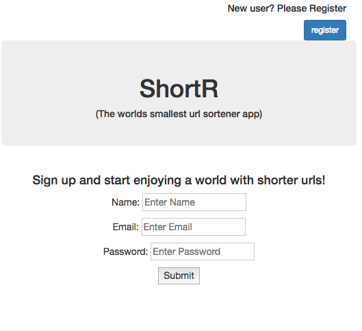
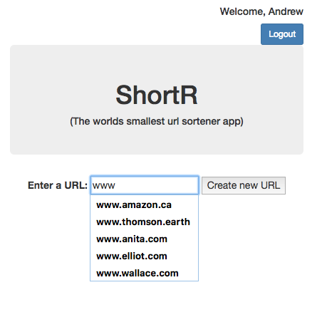

# TinyApp Project

This TinyApp project has been designed to emulate the functionality of URL shortening services such as tinyurl.com.
The focus of this project has been to utilise the expressJS web framework to build a simple app. The express cookies-session module has been used to managed user sessions securely with incrypted user IDs.

## Final Product

  
 Login view:  

  
  
 Register new users: 

  
  
 View collection of URLS: 

  
  
 Adding URL to Collection: 

  
  
 Update URL in Collection: 

  

## Dependencies

  "bcrypt": "^1.0.2",
  "body-parser": "^1.17.1",
  "cookie-parser": "^1.4.3",
  "cookie-session": "^2.0.0-beta.1",
  "crypto": "0.0.3",
  "ejs": "^2.5.6",
  "ejs-lint": "^0.3.0",
  "express": "^4.15.2"

## Getting Started

- Install all dependancies using 'npm install'  command.
- Run the development web server with the command 'node express_server.js'.
- The server runs on local port 8080, and is available at ( http://localhost:8080/ )

